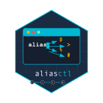

# AliasCtl - Cross-platform Shell Alias Manager



AliasCtl is a powerful tool that helps you manage shell aliases across different operating systems and shell environments. With AI-powered alias generation and conversion capabilities, it makes working with shell aliases easier than ever.

## What is AliasCtl? 🤔

Think of AliasCtl as a magic notebook for your computer shortcuts. Instead of typing long, complicated commands, you can create short nicknames (aliases) for them. The best part is that AliasCtl can:

1. Remember all your shortcuts in one place
2. Work on any computer (Windows, Mac, or Linux)
3. Use AI to create shortcuts for you!
4. Convert shortcuts between different types of computers

## Features

### Core Functionality

- **Cross-platform support**: Works on Windows, macOS, and Linux
- **Multi-shell support**: Compatible with bash, zsh, fish, ksh, PowerShell, PowerShell Core, and CMD
- **Centralized alias management**: Maintain one set of aliases across multiple shells
- **Import/Export**: Import existing aliases from your shell configuration or export them to different formats
- **Apply directly to shell**: Apply changes directly to your shell configuration files

### AI-Powered Features

- **AI-generated aliases**: Generate intuitive, memorable aliases for complex commands
- **Cross-shell conversion**: Convert aliases between different shell formats
- **Multiple AI providers**: Support for Ollama (local), OpenAI (cloud), and Anthropic Claude (cloud)
- **API key encryption**: Secure storage of API keys with local encryption

### User Experience

- **Shell completion**: Tab completion scripts for bash, zsh, fish, PowerShell and PowerShell Core
- **Interactive mode**: Interactive CLI for alias creation and management
- **TOML configuration**: Human-readable configuration files with JSON backward compatibility

## Installation Made Simple 🚀

### From Source (for developers)

```bash
go install github.com/aliasctl/aliasctl@latest
```

### Binary Releases (for everyone else)

1. Go to our [Releases page](https://github.com/aliasctl/aliasctl/releases)
2. Download the file for your computer type
3. Make it work on your computer:
   - **Windows**: Just double-click it or add to your PATH
   - **Mac/Linux**: Make it executable with `chmod +x aliasctl` and move it to `/usr/local/bin/`

## Quick Start Guide 🏁

### First-Time Setup

```bash
# Let AliasCtl figure out what kind of computer you have
aliasctl detect-shell

# Or tell it yourself
aliasctl set-shell bash  # or zsh, fish, powershell, etc.
```

### Everyday Commands

```bash
# See all your shortcuts
aliasctl list

# Create a new shortcut named 'gs' for 'git status'
aliasctl add gs "git status"

# Delete a shortcut
aliasctl remove gs

# Save your shortcuts to your computer settings
aliasctl apply

# Find shortcuts that already exist on your computer
aliasctl import
```

## AI Magic ✨

### Setting Up AI (Pick One)

```bash
# For Ollama (works on your computer without internet)
aliasctl configure-ollama http://localhost:11434 llama2

# For OpenAI (uses ChatGPT's brain)
aliasctl configure-openai https://api.openai.com YOUR_API_KEY gpt-3.5-turbo

# For Anthropic Claude (another smart AI)
aliasctl configure-anthropic https://api.anthropic.com YOUR_API_KEY claude-2
```

### Let AI Do the Work

```bash
# Let AI create a shortcut for a long command
aliasctl generate "kubectl get pods --namespace default --selector app=nginx"
# It might suggest: kgpn

# Convert a shortcut from one shell to another
aliasctl convert myalias powershell
```

## Tab Completion Magic 🔮

Make your computer automatically suggest commands when pressing Tab:

```bash
aliasctl install-completion
```

Then follow the simple instructions it shows you.

## Where AliasCtl Keeps Your Stuff 📁

AliasCtl saves your settings in:

- **Linux/Mac**: `~/.config/aliasctl/`
- **Windows**: In your `AppData\Roaming\AliasCtl` folder

### Keeping Your Secrets Safe 🔐

If you use online AI services, you need API keys (like passwords). To keep these safe:

```bash
# Lock your API keys with encryption
aliasctl encrypt-api-keys

# If you need to unlock them for some reason
aliasctl disable-encryption
```

## All the Commands You Can Use 📚

### Everyday Shortcuts

#### List All Your Shortcuts

```sh
aliasctl list
```

#### Create a New Shortcut

```sh
aliasctl add shortcut-name "the long command it replaces"
# Example: aliasctl add ll "ls -la"
```

#### Remove a Shortcut

```sh
aliasctl remove shortcut-name
# Example: aliasctl remove ll
```

#### Find Existing Shortcuts

```sh
aliasctl import
```

#### Save Shortcuts to Your Shell

```sh
aliasctl apply
```

### Sharing Your Shortcuts

#### Save Shortcuts to a File

```sh
aliasctl export bash my-shortcuts.sh
# Now you can share my-shortcuts.sh with friends!
```

### AI Features Explained

#### Set Up Ollama (Local AI)

```sh
aliasctl configure-ollama http://localhost:11434 llama2
# This tells AliasCtl to use your computer's AI
```

#### Set Up OpenAI (ChatGPT)

```sh
aliasctl configure-openai https://api.openai.com YOUR_API_KEY gpt-3.5-turbo
# This connects AliasCtl to ChatGPT's brain
```

#### Let AI Create a Shortcut

```sh
aliasctl generate "docker-compose up -d"
# AI might suggest 'dcu' for this command
```

#### Convert a Shortcut to a Different Shell

```sh
aliasctl convert gs powershell
# Converts your git status shortcut to work on PowerShell
```

### Finding Your Way Around

#### What Shell am I Using?

```sh
aliasctl detect-shell
# Tells you what type of shell AliasCtl thinks you're using
```

#### Change Your Shell Type

```sh
aliasctl set-shell zsh
# Tells AliasCtl you're using ZSH shell
```

#### Change Where Your Shortcuts are Saved

```sh
aliasctl set-file ~/.my-aliases
# Changes where AliasCtl saves your shortcuts
```

## Supported Shells (Types of Command Line)

AliasCtl works with:

- **bash**: The most common shell on Linux
- **zsh**: A newer shell popular on Mac
- **fish**: A beginner-friendly colorful shell
- **ksh**: An older but reliable shell
- **powershell**: Microsoft's modern command line
- **pwsh**: PowerShell that works on any computer
- **cmd**: The classic Windows command prompt

## Need Help?

For any questions or if something isn't working, please open an issue on our [GitHub page](https://github.com/aliasctl/aliasctl/issues).

## How It All Works (Behind the Scenes) 🔧

### What Are Aliases, Really?

Aliases are just shortcuts. Instead of typing a long command like:
