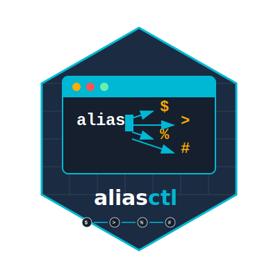

# aliasctl



AliasCtl is a cross-platform shell alias manager designed to simplify the management of shell aliases. It supports various shells including bash, zsh, fish, ksh, powershell, pwsh (PowerShell Core), and cmd. This tool is particularly useful for CNCF and Kubernetes users who often work with multiple shell environments.

## Features

- List, add, and remove aliases
- Import and apply aliases from shell configuration
- Export aliases to a file for a specific shell
- Configure AI providers (Ollama and OpenAI) for alias conversion
- Convert aliases to different shell formats
- Detect current shell and alias file

## Installation

To install AliasCtl, clone the repository and build the binary:

```sh
git clone https://github.com/aliasctl/aliasctl.git
cd aliasctl
go build -o aliasctl ./cmd/aliasctl
```

## Usage

AliasCtl provides various commands to manage your shell aliases. Below are some examples:

### List Aliases

```sh
aliasctl list
```

### Add Alias

```sh
aliasctl add <name> <command>
```

### Remove Alias

```sh
aliasctl remove <name>
```

### Import Aliases

```sh
aliasctl import
```

### Apply Aliases

```sh
aliasctl apply
```

### Export Aliases

```sh
aliasctl export <shell-type> <output-file>
```

### Configure AI Providers

#### Ollama

```sh
aliasctl configure-ollama <endpoint> <model>
```

#### OpenAI

```sh
aliasctl configure-openai <endpoint> <api-key> <model>
```

### Convert Alias

```sh
aliasctl convert <name> <target-shell>
```

### Detect Shell

```sh
aliasctl detect-shell
```

### Set Shell

```sh
aliasctl set-shell <shell-type>
```

### Set Alias File

```sh
aliasctl set-file <alias-file-path>
```

### Configure AI Provider

```sh
aliasctl configure-ai <provider> [<endpoint> <model> <api-key>]
```

## Supported Shells

- bash
- zsh
- fish
- ksh
- powershell
- pwsh (PowerShell Core)
- cmd

## Contributing

We welcome contributions from the community. Please read our [contributing guidelines](CONTRIBUTING.md) for more information.

## License

AliasCtl is licensed under the MIT License. See the [LICENSE](LICENSE) file for more details.

## Contact

For any questions or support, please open an issue on the [GitHub repository](https://github.com/aliasctl/aliasctl/issues).
